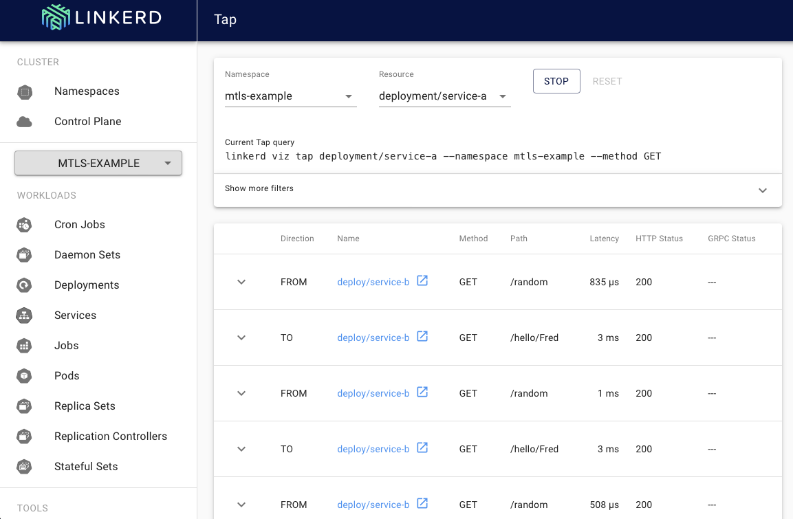

# README.md: linkerd-example

Linkerd is a service mesh designed to give platform-wide observability, reliability, and security without requiring changes to the application code.
Linkerd supports a number of use-cases.
This example project that illustrates how Linkerd's MTLS security feature works.
When you install and configure Linkerd on a Kubernetes cluster, Linkerd will ensire that all network communication between notes is TLS encrypted on both ends: the client and server must each provide a TLS certificate. 
This is known as Mutual TLS or MTLS.

This example will show how Linkerd can be installed and used to "enmesh" services so that their inter-communications is secured by MTLS. 
If you follow along, you will install Linkerd, build and deploy two services and then enmesh them with Linkerd. Then, you'll run some curl commands to call between services and verify that MTLS is in force.

Except for this README, this project was generated almost entirely by ChatGPT4 using prompts explained here: [PROMPTS.md](./PROMPTS.md).

## Prerequisites

* Knowledge of Kubernetes and the bash shell
* Access to a Kubernetes cluster you can deploy to (Docker Desktop will do)
* The `kubens` command-line tool

## Overview

This project illustrates Linkerd's MTLS feature by creating two services, Service A and Service B.

* Service A: is an HTTP service at `service-a:8080/random` that returns a random number.
* Service B: is an HTTP service at `service-b:8080/hello/{name}` that returns a hello string that includes a random number generated by Service A.

Code running on Service A can make HTTP calls to Service B and vice versa, and because Linkerd is configured, all communication between them is MTLS secured.

## How to install

* Run `./install_linkerd.sh` to install Linkerd and the Viz Dashboard
* Run `./install_servies.sh` to build and deploy Services A and B to Kubernetes
* Run `./enmesh_services.sh` to apply Linkerd to all pods in namespace `mtls-example`

## How to test

### In Terminal window #1

First, open up one terminal window and run these commands to "tap" the network:

    kubens mtls-example
    linkerd viz tap deploy

That will start monitoring Linkerd communications in the namespace.

### In terminal window #2

Next, open up a second terminal window and shell into Service A's pod. 
To find the pod use `kubectl` for example like this:

    $ kubens mtls-example
    $ kubectl get pods
    NAME                         READY   STATUS    RESTARTS   AGE
    service-a-945ccd5f8-ttnsm    2/2     Running   0          42m
    service-b-6987466dd9-srm9c   2/2     Running   0          42m

To shell into Service A, you'd do this:

    $ kubectl exec -it service-a-945ccd5f8-ttnsm -c service-a bash

Once you are in to Service A, you can run `curl` to Service A like so:

    $ curl localhost:8080/random
    0.26274826932923934

And you call over to Service B like so:

    $ curl service-b:8080/hello/Fred
    Hello Fred, here's your random number 0.853908845699539

As you run these commands you start to see output like below in Terminal window #1, the tls=true flag indicates that communications are MTLS protected. 

    req id=6:4 proxy=out src=10.1.0.128:58358 dst=10.1.0.127:8080 tls=true :method=GET :authority=service-a :path=/random
    req id=7:4 proxy=in  src=10.1.0.128:57948 dst=10.1.0.127:8080 tls=true :method=GET :authority=service-a :path=/random
    rsp id=7:4 proxy=in  src=10.1.0.128:57948 dst=10.1.0.127:8080 tls=true :status=200 latency=1982µs
    rsp id=6:4 proxy=out src=10.1.0.128:58358 dst=10.1.0.127:8080 tls=true :status=200 latency=2688µs
    end id=7:4 proxy=in  src=10.1.0.128:57948 dst=10.1.0.127:8080 tls=true duration=49µs response-length=17B
    end id=6:4 proxy=out src=10.1.0.128:58358 dst=10.1.0.127:8080 tls=true duration=32µs response-length=17B

## The Linkerd web UI 

You can launch the Linkerd dashboard via the command below:

    linkerd dashboard

You can tap the network in the web UI as well:

